# AI-Assisted Transcription & Translation Subtitle Generator

An automated pipeline that takes a video file with embedded audio,
transcribes the spoken dialogue, translates it, and produces a timed,
quality-checked subtitle file — with no manual transcription or
translation step. A second, independent workflow translates an
already-transcribed original-language `.srt` straight to English,
without any ASR step (see "Workflows" below).

It's built for long-form video (TV episodes, films) where subtitles either
don't exist in the target language or need to be regenerated, and is
tuned to avoid the two failure modes that make machine-generated
subtitles unusable in practice: hallucinated text and mistimed lines.

## Workflows

- **Workflow A — video transcription** (the pipeline below): video → audio
  → ASR → translation → English subtitle. Audio is the sole source of
  truth here; no subtitle file is ever read as transcription input.
- **Workflow B — subtitle translation**: an existing original-language
  `.srt` (e.g. a downloaded fansub, or a human-made subtitle) →
  translation → English subtitle. No ASR, no audio extraction -- the
  uploaded/selected `.srt` is already the transcription, and is never
  treated as though it came from ASR. Started from the "Translate
  Subtitle" page, it reuses the same translation engine, glossary, GPU
  lock, and job queue as Workflow A, but is a structurally separate
  pipeline (`srt_translation.py`). The source `.srt` is also committed to
  the library as that episode's own original-language subtitle (same
  sibling-pair shape a transcription job produces, e.g. `S01E01.tr.srt`
  + `S01E01.en.srt`) -- `overwrite_original` controls whether an existing
  one there is kept or replaced, independent of `overwrite_english` for
  the translated output.

## Web UI

The app serves a React UI (built into the image) on the same port as the
API (`8099` in `compose.yml`):

- **Library** (`/`) — browse the media library and queue a video for
  Workflow A, optionally choosing the audio stream ("Analyze" samples each
  track's spoken language) and whether to keep or replace existing
  subtitles. **Batch queue** mode adds checkboxes to video rows, marks
  episodes that already have an English subtitle with a ✓, and can queue
  every untranscribed episode in a folder at once with standard
  parameters. A video that fails to queue stays checked instead of being
  silently dropped.
- **Series** (`/series`) — per-series glossary: promote auto-mined name
  candidates to protected entities, edit or delete them. A **Cast
  metadata** panel shows which characters TMDB, TheTVDB and IMDb credit,
  and which of them were protected automatically. A name is protected
  only when the series' own subtitles use it as a name and the
  translation engine mistranslates it unprotected, and then only in the
  episodes it's credited in. For example, "Deniz" is a character in some
  episodes and the word for "sea" in others.
- **Translate Subtitle** (`/translate`) — Workflow B. **Batch translate**
  mode translates every episode in a folder that already has an
  original-language subtitle beside it (`<stem>.<lang>.srt`) and no English
  one yet, in one click. It only auto-picks the source when there is exactly
  one such subtitle: an episode with several (which language is the
  dialogue?), none, or an English subtitle already is skipped, with the
  reason shown on its disabled checkbox. By default existing files are kept;
  tick **Replace existing English subtitles** to re-translate episodes that
  already have one (their `.en.srt` is overwritten; the source subtitle is
  never touched). **Upload from this computer** adds subtitle files from your
  PC to the batch: each is matched to an episode by its number (`S01E03`,
  `E03`, `3. Bölüm`, ...), you can change any match from its dropdown, and an
  uploaded file wins over a library subtitle for the same episode. Uploads
  (here and in the single-episode form) may be `.srt` or `.vtt`; a WebVTT
  file is converted on read, including one that is merely *named* `.srt`
  (common for streaming-service releases), and the saved original-language
  subtitle is always a real SRT. A job that fails to queue stays ticked /
  listed with the reason shown.
- **Jobs** (`/jobs`, `/jobs/:id`) — the queue and per-job detail: live
  stage, progress bar and ETA, QC findings, log, and cancel / retry /
  delete.

**Live progress.** A job's `stage` and `progress` advance through the real
pipeline milestones (e.g. *Transcribing* → *Translating* → *Writing
output*), with ASR and translation interpolating smoothly within their
share of the bar. The percentages are a directional heuristic (ASR is the
dominant cost of a video job), not a wall-clock promise; the ETA is a
linear extrapolation and is not shown below 2%.

**Reviewing and fixing subtitles.** A completed job has an *Edit
subtitles* panel that edits the target `.en.srt` in place: text only
(timing and cue count can't be changed), written atomically, without
re-running any pipeline stage or changing the job record. Each cue's
original line breaks are preserved. Cues flagged by the timing,
readability and output QC stages sort to the top. Translation, entity and
hallucination findings are indexed by sentence or ASR segment rather than
by final subtitle cue, so they can't be pointed at one cue and are not
highlighted there; the job's `needs_review` count still includes them.

## Pipeline

Workflow A (video transcription) moves through the following stages:

1. **Audio inspection** — probe the container for available audio streams
   and their properties.
2. **Stream selection** — pick the correct source audio track (e.g. the
   original-language track over a dub) automatically or by user choice.
3. **Language detection** — identify the spoken language of the selected
   stream.
4. **ASR (automatic speech recognition)** — transcribe speech to
   timestamped text.
5. **Hallucination detection** — flag and suppress ASR output that isn't
   grounded in actual audio (a known failure mode of Whisper-family
   models on silence, music, and noise).
6. **Translation** — translate the transcript into the target language,
   one sentence at a time (NLLB silently drops everything after the first
   sentence of a multi-sentence input). Two bounded refinements guard
   against known failure modes: a long unpunctuated run-on is retried in
   fixed-size word chunks and the chunked result is kept only when it
   preserves more protected entities or avoids severe truncation; and a
   single-word cue isolated by a real acoustic pause (e.g. one word of a
   sung line) is re-translated with its neighbouring cue as grounding
   context, replacing the context-free result only on an exact-match
   extraction (segmentation is never changed; see "Tuning knobs" below).
   The second applies to Workflow A only, since an uploaded `.srt` carries
   no acoustic-gap information.
7. **Target segmentation** — re-split translated text into subtitle-sized
   lines appropriate for the target language (translated text rarely
   maps 1:1 onto the source segmentation).
8. **Timestamp projection** — map timing from the source segments onto
   the newly segmented target lines.
9. **QC (quality control)** — automated checks across transcription,
   translation, entity handling, timing, segmentation, readability, and
   output correctness, with per-category flagging.
10. **Safe atomic output** — write the final subtitle file atomically, so
    a failed or interrupted job never leaves a partial/corrupt file in
    place of a previous good one.

## Architecture

### System diagram

Component-level view of both workflows sharing one job queue, one
translation engine, and one quality-control stage before anything is
written to disk.

```mermaid
flowchart TD
    user("Subtitle user")
    tvdb("TheTVDB")
    remote("Translation server<br/>(remote, optional)")

    subgraph WEB["Web UI"]
        app["App.tsx<br/>shell + live updates (SSE)"]
        library["LibraryPage.tsx<br/>browse · queue video jobs · batch translate"]
        translatesrt["TranslateSrtPage.tsx<br/>queue SRT jobs · upload .srt / .vtt"]
        seriesui["SeriesListPage / SeriesDetailPage.tsx<br/>glossary"]
        jobsui["JobsPage.tsx<br/>job queue"]
        jobdetailui["JobDetailPage.tsx<br/>progress · QC · inline SRT editor"]
    end

    subgraph SVC["Job service"]
        api["api.py<br/>REST + SSE"]
        worker["worker.py"]
        store[("jobstore.py<br/>job database")]
        bus["events.py<br/>event bus"]
        gprofile["glossary_profile.py<br/>series title / tvdb_id"]
        tvdbclient["tvdb_client.py"]
    end

    subgraph VIDEO["Workflow A: video"]
        pipeline["pipeline.py<br/>orchestrator"]
        media["media.py<br/>probe & extract audio"]
        streams["audio_streams.py<br/>stream selection"]
        asr["asr.py<br/>ASR (faster-whisper)"]
        transcriptnode[("transcript.py<br/>canonical transcript model")]
        halluc["hallucination.py"]
    end

    subgraph SHARED["Shared translation engine"]
        srttrans["srt_translation.py<br/>Workflow B: existing SRT"]
        translate["translate.py<br/>NLLB engine"]
        seg["segmentation_target.py"]
        glossary["glossary.py<br/>entity protection"]
        proj["projection.py<br/>timestamp projection"]
        srt["srt.py<br/>parse / render SRT · WebVTT"]
        gpu["gpu.py<br/>GPU lock + VRAM pre-flight"]
    end

    subgraph QUALITY["Quality & output"]
        qc["qc/*<br/>transcription · translation · entity ·<br/>timing · readability · output checks"]
        output["output.py<br/>atomic SRT write"]
        autoglossary["auto_glossary.py<br/>mines name suggestions"]
        suggestionsfile[("glossary_suggestions/*.yaml")]
        workdir["workdir.py<br/>scratch dirs"]
    end

    user --> app
    app --> library
    app --> translatesrt
    app --> seriesui
    app --> jobsui
    jobsui --> jobdetailui

    library -->|"queues video"| api
    translatesrt -->|"queues SRT / uploads"| api
    seriesui -->|"edits glossary"| api
    jobsui -->|"lists / refreshes"| api
    jobdetailui -->|"reviews · edits srt"| api
    api -.->|"streams changes (SSE)"| app

    api --> worker
    api --> store
    worker --> store
    worker --> bus
    bus --> api

    store --> gprofile
    api --> gprofile
    worker --> gprofile
    gprofile -.-> tvdbclient
    tvdbclient -.->|"enriches metadata"| tvdb

    worker -->|"runs video jobs"| pipeline
    worker -->|"runs SRT jobs"| srttrans
    worker -->|"mines suggestions"| autoglossary
    autoglossary -->|"writes"| suggestionsfile
    api -->|"reads"| suggestionsfile

    pipeline --> media
    pipeline --> streams
    pipeline --> asr
    pipeline --> halluc
    pipeline --> proj
    pipeline --> translate
    pipeline --> srt
    pipeline --> qc
    pipeline --> output

    asr --> transcriptnode
    halluc --> transcriptnode
    proj --> transcriptnode
    translate --> transcriptnode
    streams --> gpu
    asr --> gpu
    translate --> gpu

    srttrans --> translate
    srttrans --> srt
    srttrans --> qc
    srttrans --> output

    translate --> seg
    translate --> glossary
    translate -.->|"may translate remotely"| remote

    output --> workdir
```



### How it fits together

One FastAPI process (`main.py` / `api.py`) serves the REST API, the built
frontend, and a Server-Sent Events stream (`GET /api/events`), and owns a
single background worker thread (`worker.py`) that claims and runs jobs
one at a time.

- **Job store** (`jobstore.py`) is the single source of truth for a job's
  state: a SQLite table (WAL mode) mutated only inside `BEGIN IMMEDIATE`
  transactions, so `claim()` (queued → running) can never race a
  concurrent `request_cancel()`. A job is `queued`, `running`, or one of
  three terminal states — `completed`, `failed`, `cancelled` (a fourth
  terminal value, `skipped`, is defined in the schema but no code path
  sets it today). `retry()` never reopens a finished job; it always
  inserts a new row linked back via `retry_of_job_id`, so a job's history
  is never lost, and `delete()` only ever removes a terminal job's row.
  If the process restarts while a job is `running` (crash, OOM-kill,
  redeploy), a startup sweep resets it to `queued` before the worker
  starts claiming again.
- **Live updates**: every pipeline-stage event (`ASR_PROGRESS`,
  `TRANSLATION_PROGRESS`, `QC_COMPLETED`, ...) updates the job row's
  `stage`/`progress` columns and fires an in-process `EventBus`
  (`events.py`), which pushes a change signal over SSE to every connected
  browser tab. The event carries no payload of its own — just "this job
  changed" — so a subscriber reacts by refetching `/api/jobs*`, which
  stays the single source of truth for shape.
- **GPU lock** (`gpu.py`): a single `flock` on a file under the shared
  `/cache` mount serializes GPU-heavy sections (model load through
  inference) across *every process* sharing that path, not just threads
  within one. It's reentrant per thread: the worker acquires it once for
  a job's whole pipeline run, and the pipeline's own stages (stream
  selection, ASR, translation) each acquire it again internally without
  deadlocking against that outer hold. That closes a real gap a
  per-stage-only lock left open: a concurrent "Analyze" click loading its
  own (cached) sampler model into the window *between* two of a job's own
  stages, right before the job's next stage tried to construct its model.
- **Two-host GPU split**: ASR always runs on the same host as the main
  app. Translation prefers a second GPU host running
  `translate_server.py` (`TRANSLATE_SERVER_URL`) over HTTP and falls back
  to a local NLLB copy automatically if that server is unreachable — see
  "Remote translate-server" below. The VRAM pre-flight check runs before
  every CUDA model load on *either* host, guarding against contention
  from something outside this project (a Tdarr, Jellyfin, or Plex
  transcode) that the GPU lock alone can't see, since it only serializes
  this project's own processes against each other.

### Highlights

- **ASR**: [faster-whisper](https://github.com/SYSTRAN/faster-whisper)
  running `large-v3`.
- **Translation**: NLLB-200 (1.3B). Any supported source language is
  translated to **English**; English is the only output language (see
  "Output language" below).
- **Entity protection**: named entities (character names, places) are
  identified and protected through translation so they aren't mangled or
  inconsistently rendered across a series.
- **Stream-aware caching**: intermediate artifacts are cached per audio
  stream/config, so re-running a job with a different setting doesn't
  repeat expensive ASR work unnecessarily.
- **VRAM pre-flight mechanics**: before every in-process CUDA model
  load (ASR, local NLLB, the remote translate-server's NLLB, the stream
  sampler) the app polls free VRAM for up to 20 s and, if the required
  headroom never appears, fails the job with `InsufficientVramError`
  rather than attempting a load that would likely CUDA-OOM. Default margin
  is 3.2 GB (the sampler's lightweight model needs only 0.5 GB).
- **Lightweight stream sampling**: the library's "Analyze" button (spoken
  language per audio track) uses a small Whisper model (`small`, roughly
  200 MB of VRAM) instead of `large-v3` (roughly 3 GB), so an Analyze click
  can't crowd out a running job. If the small model isn't cached it falls
  back to `large-v3` with a logged warning.

## Output language

Output is always English: the translation model is pinned to English
output, and both workflows always write `<video stem>.en.srt`. Both
job-creation endpoints (`POST /api/jobs`, `POST /api/srt-translations`)
accept `target_lang` only as `"en"` (the default) and reject anything else
with HTTP 422 (`target_lang must be "en"; multi-target translation is not
supported`). The field is still stored on job records for compatibility.

## Status

Production-deployed on a single dedicated NVIDIA RTX 3070 GPU (Ampere,
`float16` compute -- see `asr.AsrConfig.compute_type`'s docstring for
which GPUs need `int8` instead, e.g. a Tesla P4, this project's prior
host until a 2026-09-27 migration to dedicated hardware). Translation
(NLLB) runs on the same GPU, serialized against ASR via the same per-job
GPU lock (see `translate.TranslationConfig.device`'s docstring for the
real VRAM-headroom analysis behind this). The card is dedicated to this
app, so the defaults use the dedicated-GPU profile (see
`SUBTITLE_AI_GPU_SHARED`): larger NLLB batches, and the model kept loaded
between jobs. Measured on this card (`benchmark-results/`), a full episode
takes about 7 minutes end to end, of which ASR is about 82%, and a
subtitle-only translation job takes under a minute. The VRAM pre-flight
check stays on regardless, since it's cheap insurance for any deployment
where a GPU is shared. Translation can
optionally be offloaded to a second GPU host instead of running locally
(see "Remote translate-server"); this deployment currently runs both
stages on the one local GPU. Run the tests (see "Development" below)
rather than trusting a hardcoded number here, since it drifts with every
change.

## Running it

The project ships as a Docker Compose service with GPU passthrough:

```bash
docker compose up -d
```

The container expects the following volumes to be provided (see
`compose.yml`):

- a media directory mounted read-write, for input video and output
  subtitle files
- a models directory, for cached faster-whisper/NLLB model weights
- a cache directory, for the job database and intermediate work files
- a glossary directory (read-only), for per-series entity/name overrides

GPU access requires the NVIDIA Container Toolkit configured on the host.

Configuration is supplied via environment variables in `compose.yml`
(see that file for the current set, including optional TVDB metadata
lookup credentials).

### ASR decoding defaults

Chosen by measuring word recall against a human-made SRT for Love Is In
The Air S01E01 (two 20-minute windows; `asr.py` module docstring has the
table):

- **Hotwords are off** (`SUBTITLE_AI_ASR_HOTWORDS=on` restores them). The
  glossary/auto-mined list made Whisper output Title Case and dropped
  audio windows; character-name recall is ~3-5 points lower without it.
- **VAD is more permissive** than faster-whisper's default (onset 0.3,
  offset 0.15, 1 s minimum silence, 500 ms pad), worth +1.3 to +4.1
  points of recall.

Both are part of the transcript cache identity, so existing cached
transcripts are not reused after the change.

### Scratch work directories

Each job's intermediate files (extracted audio, stream samples,
pre-commit subtitles) live in `SUBTITLE_AI_WORK_ROOT/<job_id>` (default
`/cache/work`). They are managed automatically:

| Job outcome | What happens to its scratch directory |
|---|---|
| Completed, cancelled | Removed as soon as the job finishes (final subtitles are already committed to the media library) |
| Failed, validation failure | Kept for diagnosis for `SUBTITLE_AI_FAILED_WORK_RETENTION_HOURS` (default `24`), then removed |
| Job deleted via the API | Removed immediately |

A sweep at startup and then hourly removes anything past its window,
including directories with no matching job. It never touches queued or
running jobs, and only ever removes direct child directories of the work
root -- never the transcript cache, job database, or SRT upload staging.
Cleanup problems are logged and never change a job's result.

### Tuning knobs

| Variable | Default | Effect |
|---|---|---|
| `SUBTITLE_AI_API_KEY` | unset (open; intended for a LAN) | When set, endpoints that queue work, upload subtitles, perform audio-stream analysis, or mutate job/glossary/subtitle state require a matching `X-API-Key` header. When unset, cross-origin browser requests to those mutation endpoints are rejected using `Origin`/Fetch Metadata; headerless non-browser clients remain usable. Read-only endpoints stay open. |
| `SUBTITLE_AI_FAILED_WORK_RETENTION_HOURS` | `24` | How long a failed job's scratch directory is kept (see below). |
| `SUBTITLE_AI_ASR_HOTWORDS` | off | `on` feeds glossary names to Whisper as hotwords (see "ASR decoding defaults"). |
| `FAILURE_WEBHOOK_URL` | unset | A plain JSON POST is sent to this URL when a job fails (works with anything that accepts one, or a relay in front of it). |
| `TVDB_API_KEY`, `TVDB_API_PIN` | unset | Optional TheTVDB access: series titles and per-episode characters. The app never depends on it. |
| `TMDB_API_KEY` | unset | Optional TMDB access: per-episode cast and guest stars. With TVDB and IMDb's free datasets, this feeds automatic name protection (below). |
| `SONARR_URL`, `SONARR_API_KEY`, `RADARR_URL`, `RADARR_API_KEY` | unset | Sonarr and Radarr identify the series or movie a file belongs to, including its TVDB/TMDB/IMDb/TVmaze IDs and original language. They're used before `{tvdb-…}` folder tags. Movies need Radarr to get their own glossary. |
| `PLEX_URL`, `PLEX_TOKEN`, `JELLYFIN_URL`, `JELLYFIN_API_KEY` | unset | After a job writes subtitles, Plex rescans just that folder and Jellyfin is told about just those files. A server that's down never fails a job. `SUBTITLE_AI_MEDIA_REFRESH=off` turns this off. |
| `SUBTITLE_AI_CAST_REFRESH_DAYS` | `30` | How often the idle worker re-checks each series' cast metadata. `0` turns automatic checks off. |
| `SUBTITLE_AI_SAMPLE_MODEL` | `small` | Whisper model the library's "Analyze" button uses. |
| `SUBTITLE_AI_VRAM_MARGIN_GB` | `3.2` | Free VRAM the pre-flight check waits for before loading a large model. Must be a number. |
| `SUBTITLE_AI_NAME_CORRECTION` | on | After transcription, fixes character names Whisper mishears as a near-identical name ("Aydın" → "Aydan"), using the episode's cast. `off` disables it. |
| `SUBTITLE_AI_ORPHAN_CONTEXT_PADDING` | on | `off`, `0`, `false` or `no` disables the isolated-word grounding pass. |
| `SUBTITLE_AI_CODE_SWITCH_DETECTION` | on | `off`, `0`, `false` or `no` disables per-sentence language-override detection: a run of 3+ consecutive sentences confidently identified as a different language than the job's own source language is translated using that language instead (e.g. a foreign-language cold-open scene). See CLAUDE.md for the measured thresholds. |
| `SUBTITLE_AI_GPU_SHARED` | off | Declares the GPU shared with something else (Tdarr, Jellyfin/Plex transcodes). Restores the contention-safe NLLB sizing (batch 8), per-batch cache release, and freeing NLLB after every job. Leave off on a dedicated card. |
| `SUBTITLE_AI_NLLB_BATCH_SIZE`, `SUBTITLE_AI_NLLB_NUM_BEAMS` | `32`, `2` (`8`, `2` when shared) | NLLB generation sizing. Batch changes speed and VRAM only; beams change the translations themselves. |
| `SUBTITLE_AI_MODEL_IDLE_SECONDS` | `600` (`0` when shared) | How long NLLB stays loaded after a job so the next one skips the model load. It is evicted early whenever ASR or the Analyze sampler needs the GPU. `/api/health` reports `nllb_resident`. |
| `SUBTITLE_AI_NLLB_BACKEND` | `ct2` | `ct2` runs a CTranslate2 conversion of the same model: about 3x faster than `hf` (transformers), with the same measured quality against human subtitles. Convert once with `scripts/convert_nllb_ct2.py`; without the converted model the app logs a warning and uses `hf`. |
| `TRANSLATE_SERVER_IDLE_UNLOAD_SECONDS` | `120` | Remote translate-server only: idle seconds before its NLLB model is unloaded (see "Remote translate-server"). |
| `TRANSLATE_SERVER_DEFAULT_LANG` | `tr` | Remote translate-server only: source language warmed at boot so the first request doesn't pay model-load latency. |
| `TRANSLATE_SERVER_API_KEY` | unset | Required on both hosts when remote translation is enabled; sent as `X-API-Key` to protect `/translate`. |
| `SUBTITLE_AI_TURN_DETECTION` | off | `heuristic` or `voice` turn on speaker-turn detection (`subtitle_ai/turns.py`). Off by default -- see CLAUDE.md for why neither cleared the bar yet. |
| `SUBTITLE_AI_ASR_STYLE` | off | `natural` feeds Whisper a short natural-dialogue sample as `initial_prompt`, an experiment to recover dropped interjections. Gated on measured results (CLAUDE.md); off until then. |

**TLS-terminating reverse proxies.** When the app is behind a proxy,
the no-API-key Origin check compares the request's `Origin` to the
scheme and host in the ASGI request scope. The app does not use
`X-Forwarded-Proto` or `X-Forwarded-Host` directly. Configure Uvicorn to
trust forwarded scheme headers only from the actual proxy addresses
(for example, set `--forwarded-allow-ips` to the proxy IPs rather than
`*`), and have the proxy overwrite forwarded headers and pass the
external `Host` through. Otherwise legitimate HTTPS requests may be
rejected, or trusting untrusted forwarded headers could make origin
checks spoofable. The bundled Compose deployment exposes the app
directly and does not configure a reverse proxy.

All of these are forwarded from `.env` (see `.env.example`): by `compose.yml`
for the main app, and by `compose.translate-server.yml` for the remote host
(`TRANSLATE_SERVER_IDLE_UNLOAD_SECONDS`, `TRANSLATE_SERVER_DEFAULT_LANG`, plus
`SUBTITLE_AI_VRAM_MARGIN_GB`, which both hosts honour). An empty or unset
value means the default, and invalid values (a non-numeric or negative
number, or a language code the translation model doesn't know) fall back to
the default with a logged warning rather than failing to start or silently
disabling the feature.

To pre-cache the `small` sampler model once on the host (the app's `/models`
mount is read-only, so it can't download it itself), run this from a Python
environment that has `faster-whisper`, pointing `CONFIG_PATH` at the same
appdata directory `compose.yml` mounts (or set `MODELS_DIR` directly):

```bash
CONFIG_PATH=/path/to/appdata python scripts/download_sample_model.py
```

### Database backups

`scripts/backup_jobs_db.sh [source_db] [backup_dir]` takes a safe online
backup of the SQLite job store (sqlite3's `.backup`, fine against the live
WAL database; no need to stop the container), gzips it, and prunes backups
older than 14 days. Its default paths match one specific deployment, so
pass both arguments for yours. It uses the `sqlite3` CLI when present and
Python's built-in backup API otherwise. The schedule is a host crontab
entry (see the script's header); crontabs don't move with the app, so add
it again on a new host.

### Measuring throughput and quality

- `scripts/bench_translate.py` times NLLB configurations on a real
  subtitle file and shows which lines change between them.
- `scripts/eval_translation.py` scores translation systems against the
  human English subtitles (`.en.hi.srt`) kept beside many episodes, using
  the real Workflow B path and corpus chrF with bootstrap intervals. It can
  also write a blind A/B review sheet.
- `scripts/eval_transcription.py` scores transcription against the same
  human subtitles. It reports word error rate on dialogue (wrong, missed
  and extra words), character-name recall, and song-lyric coverage
  separately. It can re-score cached transcripts instantly, or run Whisper
  with changed settings.

Results are kept in `benchmark-results/`.

### Remote translate-server (optional)

`translate_server.py` can run on a separate GPU host (`TRANSLATE_SERVER_URL`
on the main app; deployed with `scripts/deploy.sh`) and the main app falls
back to local translation if it is unreachable. It keeps **exactly one**
NLLB model resident regardless of how many source languages it serves (a
further language costs only a small tokenizer), runs one translation at a
time, and unloads the model after `TRANSLATE_SERVER_IDLE_UNLOAD_SECONDS`
(default `120`) with no activity so a shared GPU is freed between jobs.
It never unloads while a request is running or queued, and applies the same
VRAM pre-flight check before loading the model (that GPU is typically shared
with a media server's hardware transcoding). Set the same
`TRANSLATE_SERVER_API_KEY` in the main app's and remote server's `.env`;
`POST /translate` requires it and rejects request bodies over 1 MiB, more
than 128 sentences, or sentences over 4096 characters. If the key is
unset, the server returns 503 and the main app falls back to local
translation. An unsupported `src_lang` returns HTTP 422; `GET /health`
remains open for deployment health checks and reports `model_loaded`.

## Development

Backend tests (the `uv run` form works from a fresh shell; see `.github/
workflows/test.yml` for the exact CPU-only CI setup):

```bash
PYTHONPATH=subtitle_ai uv run --with pytest pytest tests -q
```

Frontend (React + Vite + Vitest, in `frontend/`):

```bash
cd frontend && npx tsc --noEmit && npm test -- --run
```

Deploying (`scripts/deploy.sh`) builds the image, redeploys the main app,
ships the same image to the translate-server host, and health-checks both;
set `SKIP_REMOTE=1` for changes that don't touch `translate.py` or
`translate_server.py`. `CLAUDE.md` holds deploy and operations notes;
`docs/IMPROVEMENT_PLAN.md` and `docs/ENHANCEMENT_DRAFT.md` are completed,
frozen planning rounds; `CLAUDE.md` is the live, continuously-updated log of
what has shipped since.
