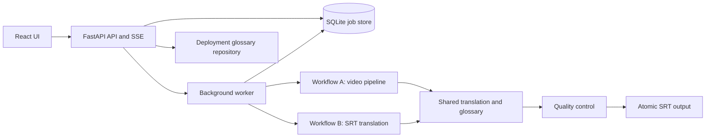

# Architecture

## Overview

Subtitle AI is a single web application with a React frontend, a Python API
and worker, a SQLite job store, and a GPU-backed subtitle pipeline. Workflow A
starts from video audio; Workflow B starts from an existing subtitle file.
They share job management, glossary handling, translation, quality control,
and safe output behavior.

## Runtime components

| Component | Responsibility |
|---|---|
| `subtitle_ai/api.py` | REST endpoints, Server-Sent Events, input validation, and browser-facing operations. |
| `subtitle_ai/worker.py` | Claims jobs, runs pipelines, records progress, handles retries/cancellation, and performs idle maintenance. |
| `subtitle_ai/jobstore.py` | Durable SQLite lifecycle, logs, job state, and concurrency-safe status transitions. |
| `subtitle_ai/pipeline.py` | Orchestrates video transcription, source segmentation, translation distribution, target segmentation, projection, and output. |
| `subtitle_ai/srt_translation.py` | Orchestrates direct subtitle-to-English translation without ASR. |
| `subtitle_ai/asr.py` | Faster-Whisper transcription, cache provenance, recovery, and timestamp normalization. |
| `subtitle_ai/translate.py` | NLLB/CT2 translation, glossary protection, code-switch handling, and bounded translation recovery. |
| `subtitle_ai/qc/` | Advisory and structural quality checks for transcription, translation, timing, readability, entity handling, and output. |
| `subtitle_ai/glossary.py` | Entity protection (`protect()`/`restore()`) and forced-phrase overrides against parsed cue text. |
| `subtitle_ai/glossary_profile.py`, `glossary_files.py` | Series-profile lookup/layering (global -> language -> series), locked and atomic reads/writes of deployment-owned glossary YAML. |
| `subtitle_ai/auto_glossary.py` | Per-language proper-noun mining (`MINERS` registry: tr, ms, ja, ko, zh) that produces *suggestions* only — feeds ASR hotwords and the series review UI, never auto-protects a name (see `CLAUDE.md`'s "Entity-protection precedent: the evidence bar"). |
| `subtitle_ai/cast_enrichment.py`, `cast_metadata.py` | Cast metadata ingestion (TMDB/TVDB/IMDb/NFO), transcript evidence checks, and the only path that can auto-*protect* a name, gated by credited metadata + recurring transcript evidence + a demonstrated unprotected-translation failure. Runs on a per-series staleness interval (`refresh_days()`, default 30 days) from worker idle time. |
| `subtitle_ai/langid.py` | Per-sentence/clause language-override detection for code-switched dialogue (e.g. a foreign-language cold open inside an otherwise single-language episode); gates a group of source sentences to their own detected-language NLLB tokenizer instead of the job's declared source language. |
| `subtitle_ai/hallucination.py` | Suppresses ASR output not grounded in the audio (repetition loops, ungrounded insertions). |
| `subtitle_ai/name_correction.py` | Post-ASR name-spelling normalization against known glossary/cast forms. |
| `subtitle_ai/turns.py` | Speaker-turn detection (`heuristic` and `voice`/WeSpeaker-embedding detectors behind one interface). Implemented and tested, but ships **off** by default — see `CLAUDE.md`'s "Speaker-turn detection" entry for why neither detector cleared the production bar. |
| `subtitle_ai/gpu.py` | Cross-process GPU locking, VRAM preflight, and resident-model coordination. |

## Workflow A: video to English SRT

1. The API creates a video job and the worker claims it.
2. `media.py` and `audio_streams.py` inspect streams and select source audio.
3. `asr.py` produces a timestamped transcript; hallucination checks suppress
   ungrounded content.
4. Source cues are built and passed to `translate.py`, including glossary and
   language-override logic.
5. English text is segmented, projected onto source timing, and checked by QC.
6. Output is written atomically and the job receives its terminal result.

## Workflow B: source subtitle to English SRT

1. The API accepts a library subtitle or upload in SRT/WebVTT form.
2. The source is parsed and normalized into SRT cues; no audio extraction or
   ASR runs.
3. Shared translation, glossary, target-segmentation, projection, and QC
   stages run.
4. Source and English outputs are handled independently according to their
   overwrite settings.

## Key boundaries and invariants

- Video audio is the sole transcription source for Workflow A.
- English is the supported target language.
- The job database is the source of truth for lifecycle state; do not infer
  status from filesystem artifacts.
- The glossary directory is deployment-owned and may be a separate Git
  repository. Its edits are serialized and atomically persisted.
- GPU model loads must use the shared preflight and residency protocol.
- A final SRT write must be atomic; never write directly over a known-good
  output.
- QC findings are generally advisory. Only structural invalidity prevents a
  successful output.

## External integrations

| Integration | Use | Failure behavior |
|---|---|---|
| Media filesystem | Video and subtitle discovery, outputs, uploads | Validate root containment and supported paths. |
| TMDB, TVDB, IMDb, NFO | Character-credit enrichment | Lack of metadata/evidence skips enrichment rather than inventing entries. |
| Plex and Jellyfin | Refresh media metadata after output creation | Notification is asynchronous and does not block the job queue. |
| Optional remote translate server | Offload NLLB translation | Validate responses strictly and fall back to local translation. |

## Feature toggles

Several pipeline behaviors are implemented and tested but gated behind
`SUBTITLE_AI_*` environment variables rather than always-on, because their own
real-data measurement didn't clear the bar for a production default (e.g.
speaker-turn detection, the natural-dialogue ASR style prompt). README's
"Tuning knobs" table is the current source of truth for each toggle's
default and what flipping it does; `CLAUDE.md` has the measurement each
default is based on. Do not infer a toggle's default from the fact that its
code exists — check the table.

## Operational model

The API and worker run together in the deployed service. GPU-intensive work is
serialized to protect memory. Caches are versioned where pipeline semantics
change. Failed work directories are retained temporarily for diagnosis, while
completed and cancelled work is cleaned up. Health and live job events provide
the primary operational signals.

Start at `docs/handover.md` for current session-to-session state. See
`README.md` for deployment and API-facing behavior, `CLAUDE.md` for current
host operations, measurements, and shipped-decision history, and any
`docs/*-handoff.md` files for specific gaps already scoped for a future
session to pick up (see `docs/agents.md`'s handover section).
