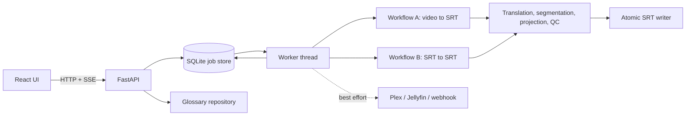

# Architecture

How Subtitle AI is built, where its boundaries are, and which rules keep them
there. Product intent is in `docs/product-requirements.md`; the audit that
classified the code is `docs/decisions/2026-10-02-architecture-audit.md`. This
document says what is true **now**, and marks target structure that is not built
yet as **planned**.

## 1. System overview

A single deployable: a React UI, a FastAPI process, a background worker thread,
a SQLite job store and a GPU pipeline, in one container. Two workflows share
job management, glossary handling, translation, QC and safe output.

Workflow A: media inspection, audio-stream selection, language detection, ASR,
transcript normalisation, hallucination filtering, name correction, translation,
source and target segmentation, projection onto speech timing, QC, output.
Workflow B: subtitle parsing and validation, language validation, translation,
target segmentation, QC, output. Workflow B shares the translation, glossary,
segmentation and QC code but imports no ASR module (a test pins it).

## 2. Components and dependency rules

| Component | Module(s) | Owns |
|---|---|---|
| HTTP layer | `api.py`, `events.py`, `startup_guard.py`, `alerting.py` | Routes, validation, auth, SSE. No pipeline logic. |
| Job lifecycle | `jobstore.py`, `worker.py`, `workdir.py`, `job_config.py`, `errors.py` | State machine, claim/recovery, scratch dirs, configuration snapshot, typed errors. |
| Workflow A | `pipeline.py` | Orchestration of the stages below. |
| Workflow B | `srt_translation.py` | Orchestration of subtitle translation. |
| Media | `media.py`, `audio_streams.py` | ffprobe/ffmpeg, stream ranking and language sampling. |
| ASR | `asr.py`, `transcript.py`, `normalize.py`, `hallucination.py`, `name_correction.py`, `turns.py` | Transcription, cache provenance, canonical transcript, suppression, rule-based normalisation. |
| Translation | `translate.py`, `translate_server.py`, `langid.py` | Local/remote NLLB, batching and recovery, code-switch detection. |
| Subtitle processing | `segmentation_source.py`, `segmentation_target.py`, `projection.py`, `text_segmentation.py`, `subtitle_constraints.py`, `srt.py` | Cues, timing, constraints, SRT/WebVTT parsing and rendering. |
| Subtitle re-timing | `retime.py`, `scripts/retime_subtitle.py` | Moves an existing subtitle's cues onto the audio's word times without changing text; not part of Workflow A or B. |
| QC | `qc/*` | Advisory per-stage findings. Never mutates a subtitle. |
| Glossary and cast | `glossary.py`, `glossary_profile.py`, `glossary_files.py`, `auto_glossary.py`, `cast_enrichment.py`, `cast_metadata.py` | Entity protection, layered profiles, mined suggestions, evidence-gated enrichment. |
| Output safety | `output.py` | Path containment, protected suffixes, atomic write. |
| GPU | `gpu.py` | Cross-process lock, VRAM pre-flight, residency, release. |
| Integrations | `arr_client.py`, `tvdb_client.py`, `media_servers.py`, `alerting.py` | External services (section 12). |
| Logging | `logging_setup.py` | Job-tagged, optionally JSON, logs. |

**Rules.** Dependencies point toward stable, lower-level modules:

1. `api.py` calls the job store and read-only helpers; it never runs a pipeline
   stage. (Today it also imports `translate`, `cast_enrichment` and `gpu` for
   language lists, reports and the sampler: see section 13.)
2. Pipelines depend on stage modules, never on `api.py` or `worker.py`.
3. Stage modules depend on `transcript`/`srt` data types and `output`, not on
   each other's internals.
4. `qc/*` read data and return findings; they do not write.
5. Filesystem writes of subtitles go through `output.write_srt_atomic` only.
6. No module outside `worker.py` and `main.py` starts threads that touch the job
   store.
7. Configuration is read at documented points (section 11), not scattered.

## 3. Domain model

What exists, typed:

| Concept | Type | Notes |
|---|---|---|
| Audio stream, candidate, recommendation | `audio_streams.AudioStream`, `StreamCandidate`, `StreamRecommendation` | Container tag is evidence; sampled language ranks; the ASR result is authoritative. |
| Transcript | `transcript.CanonicalTranscript`, `Segment`, `Word`, `ModelInfo`, `Correction` | Audio-derived; carries ASR provenance, per-word probability, suppression and correction records. |
| Subtitle cue | `srt.SrtCue`, `segmentation_target.TargetCue`, `projection.ProjectedCue`, `srt_translation.ValidatedCue` | Four shapes for four stages (below). |
| Glossary | `glossary.Entity`, `PhraseEntry`, `glossary_profile.Profile` | Surface forms, scope, case sensitivity, provenance. |
| Cast | `cast_metadata.CastMember`, `CastBook`, `cast_enrichment.Candidate` | |
| QC | `qc.types.QcFinding`, `QcResult`, `JobQc` | |
| Errors | `errors.SubtitleAiError` and subclasses | Stable codes. |

What does not exist as a type: a **job** is a plain `dict` (the row), `MediaAsset`
and `OutputArtifact` do not exist, and `PipelineResult` is a loose dataclass. Do
not add classes for their own sake; introduce a type when a boundary needs it
(see section 14, "Next structural steps"). Prefer immutable data between stages.

## 4. Pipeline stages

Each stage has an explicit input and output, validates, logs with the job ID, and
fails with a typed error. A stage must not perform another stage's work.

| Stage | Input -> output | Owner |
|---|---|---|
| Media inspection | path -> streams, duration | `media`, `audio_streams` |
| Audio selection | streams -> stream index + reason | `audio_streams.recommend_stream` |
| Audio extraction | video, stream -> WAV (no `-ss`/`-itsoffset`) | `media` |
| Language detection | WAV -> language, probability | `asr` (acoustic) |
| ASR | WAV, options -> `CanonicalTranscript` | `asr` |
| Normalisation | transcript -> transcript (recorded corrections) | `normalize`, `name_correction` |
| Hallucination filtering | transcript -> suppression flags | `hallucination` |
| Source segmentation | words -> source cues | `segmentation_source` |
| Translation | cues -> English text per span | `translate` |
| Target segmentation | English text, source envelope -> target cues | `segmentation_target` |
| Projection | target cues, source timing -> final cues | `projection` |
| QC | everything -> `JobQc` | `qc` |
| Output | cues -> atomic files | `output` |

Workflow B replaces the first six with: parse -> validate -> language check.

**Time bases.** ASR word times (relative to the extracted WAV); source cue times
(from words, or from the source subtitle in Workflow B); translated span
boundaries (no time of their own); target cue times (distributed inside the
source envelope); and projected final times. No stage adds an offset. See
`docs/decisions/subtitle-timing.md`.

## 5. Job model

Stored `status`: `queued`, `running`, `completed`, `failed`, `cancelled`
(`skipped` exists in the schema but nothing sets it). `cancel_requested` is a
flag. The exposed `lifecycle` derives the documented names: QUEUED, RUNNING,
CANCELLING (running with a cancel requested), CANCELLED, SUCCEEDED, FAILED. The
stored values are a public contract for existing rows and clients, so they are not
renamed.

A job row records: id, workflow (`job_type`), source media or subtitle, created /
started / finished / updated times, `stage`, `progress`, requested and selected
language and audio stream (with reason), `phase_durations`, retry lineage and
`attempt`, `claim_count` and recovery counters, `error` and `error_category`
(stable code), QC by stage and `needs_review`, output paths, a bounded log, and a
`config_snapshot` taken when the worker starts the job. Warnings live in the log
and QC findings. Output artifacts are the `outputs` path list.

Transitions are made by the store under `BEGIN IMMEDIATE`: claim, finish, cancel,
delete and recovery are atomic. A failure webhook fires only on the transition
into `failed`. On startup, jobs left `running` are re-queued up to a bound, then
failed with `ORPHANED_JOB_RECOVERY_EXHAUSTED`.

**Known gap.** The worker is a daemon thread with no graceful stop: a container
stop mid-job kills it, and the next start recovers the job from the beginning
(cached ASR makes that cheap). Graceful checkpoint-and-stop is planned work.

## 6. GPU resource management

GPU access is a resource-management problem. `gpu.gpu_lock()` is a cross-process
`flock` on a file under the shared cache mount, reentrant per thread; a job holds
it for its whole pipeline. `preflight_vram_check()` runs before every in-process
CUDA model load and raises `InsufficientVramError` rather than attempt a load that
would OOM; resident models (NLLB between jobs) are evicted before another model
loads. `free_gpu()` runs in `finally` blocks and again after an exception has
unwound. GPU failures are typed (`GPU_RESOURCE_ERROR`). Module-level model state
exists only in `gpu._residents`, `translate._resident` and the API's sampler
cache, each with a documented lifecycle.

## 7. Translation

`translate.translate_spans()` is the single entry. It runs locally (CTranslate2 or
Hugging Face NLLB) or through the remote translate server, falling back to local on
any remote failure, validating response shape strictly. It handles glossary
protection (`protect()`/`restore()`), forced phrases, orphan-context padding,
bounded retry of suspicious outputs and deterministic entity recovery.

**Provider isolation is not built yet.** Callers pass `model`, `tok`, `bos`,
`remote_url` and a config; there is no `TranslationProvider` or `ASRProvider`
interface. The intended shape is a protocol with `translate(segments, context)`
and `transcribe(audio, options)`, with the NLLB and faster-whisper code behind it
and the pipeline receiving providers. It is deferred until the pipeline's tests
can move to fakes without losing coverage (section 14).

## 8. Glossary and code-switching

Glossary behaviour is deterministic: layered profiles (global, language, series)
load from deployment-owned YAML; matching is by exact surface form with documented
case and Turkish-suffix rules; protection replaces a name with a placeholder before
translation and restores it after. Mined candidates are suggestions. Automatic
protection requires cast-metadata credit, recurring transcript evidence and a
demonstrated unprotected-translation failure (`cast_enrichment.py`).

Code-switching: `langid.detect_language_overrides()` runs on the already-decoded
(audio-derived) text, at clause level (sentences split on punctuation and commas).
A clause needs at least 20 characters and at least 0.90 detector confidence to
count; a run of at least 3 consecutive qualifying clauses in one language other
than the job's marks their sentences to be translated with that language. A
shorter clause neither counts nor breaks a run. Shorter runs and anything below the
thresholds stay with the job language, because the detector is confidently wrong
on short lines ("Vay be!" as English). Limits:
a text detector, so very short or mixed lines are not overridden; thresholds were
measured on one real episode and a 90,076-cue library
(`docs/decisions/2026-09-29-code-switched-dialogue-mistranslated-per-sentence-language-o.md`).

## 9. Quality control

Per-stage advisory checks (`qc/*`): transcription, translation, entity, timing,
readability, segmentation, output, and source-side readability and output. A job
fails only on structural findings. `needs_review` counts entity and hallucination
findings and anything at confidence 0.7 or higher. QC never changes a subtitle; text-changing behaviour lives in a named
stage (`name_correction`, `normalize`, glossary restore, target segmentation).

## 10. File safety

Subtitles are written by `output.write_srt_atomic`: a uniquely named temporary file
in the target directory, `fsync`, an atomic `os.replace`, and the temporary file
removed on failure. Content is validated before this call (the pipeline's `valid`
check and the SRT parser), not inside it. `allow_overwrite=False` keeps an existing file
(reported as KEEP). Paths are resolved against the media root, reject `..`,
symlinks leaving it and protected suffixes (`resolve_media_path`,
`resolve_output_path`). Source and English outputs have independent overwrite
policies. Glossary YAML is written round-trip under a file lock. A failed job
leaves existing outputs untouched.

## 11. Configuration

| Layer | Examples | Where |
|---|---|---|
| Deployment | media, cache, glossary paths; ports; GPU | `compose.yml`, `.env`, `main.py` |
| Application | auth key, bind host, log format, health thresholds | environment, read at startup |
| Model | ASR model, compute type, NLLB backend, VRAM margin | `AsrConfig`, `TranslationConfig`, environment |
| Behaviour toggles | name correction, hotwords, code-switch detection, turn detection | `SUBTITLE_AI_*`; README "Tuning knobs" |
| Job-specific | language, stream, overwrite flags | the job row |
| Runtime state | residency, locks, caches | process memory and `/cache` |

Environment variables are read at module import or call time, so they act as
implicit global state. To keep a job explainable after configuration moves on, the
worker records `job_config.capture()` (an allowlist; never credentials, hosts or
paths) in the job's `config_snapshot` when it starts the job. Making the pipeline
take an explicit configuration object instead of reading the environment is
planned (section 14).

## 12. Integrations

Each is behind a small module with its own failure policy (see the PRD table):
Sonarr/Radarr (`arr_client`, optional), TMDB/TVDB/IMDb/NFO (`cast_metadata`,
`tvdb_client`, optional, best effort), Plex/Jellyfin (`media_servers`, best effort),
the failure webhook (`alerting`, best effort) and the remote translate server
(`translate`, optional with local fallback). Integration failures never fail a
job. They are modules with functions, not classes with interfaces; interfaces will
be added where a second implementation or a fake is actually needed.

## 13. Security model

**Assets:** the media library (subtitle files are written into it), GPU time,
job history and the glossary repository. **Trust:** the deployment targets a
home-lab LAN; the operator is trusted; any client that can reach the port may be
untrusted. **Threats considered and controls:**

| Threat | Control |
|---|---|
| Unauthenticated use of the API from the network | Server refuses a non-loopback bind without a key unless the operator opts in; with a key, every route but health requires it (test enumerates routes). |
| Cross-site requests from a browser on the LAN | With no key, mutating requests are rejected on `Sec-Fetch-Site`/`Origin` mismatch; behind a TLS proxy the proxy must preserve `Host`/forwarded headers. |
| Path traversal and symlink escape | Paths resolved against the media root, symlinks leaving it rejected. |
| Overwriting or damaging files | Atomic writes, protected suffixes, independent overwrite flags. |
| Malicious or oversized uploads | `.srt`/`.vtt` only, UTF-8, 2 MiB cap, stored under the app's cache, swept on a retention timer. |
| Command injection | `subprocess` is called with argument lists (ffmpeg/ffprobe, git for glossary commits), never a shell; paths come from validated resolution. |
| SSRF | URLs (translate server, webhook, Plex, Jellyfin, Sonarr, Radarr) are operator environment variables, never request fields; the remote translate server also requires its own key. |
| Secret leakage | Secrets are environment-only; `config_snapshot` and logs use an allowlist; the API key is compared in constant time. |

**Not addressed:** TLS termination (use a reverse proxy), per-user permissions,
rate limiting beyond the SSE subscriber cap, and protection of the API key in the
browser beyond `localStorage`. Authentication beyond one shared key is out of scope
until a requirement exists.

## 14. Known boundary violations and next structural steps

Audited 2026-10-02 (details in the audit record):

- `api.py` imports pipeline-side modules (`translate`, `cast_enrichment`, `gpu`,
  `audio_streams`) and holds module-level state (`_store`, `_worker`, the sampler).
- `worker.py` imports `api` for the shared sampler, and is large (about 850 lines)
  because it holds both workflows' orchestration and idle maintenance.
- `translate.py` (about 1,100 lines) mixes engine loading, batching, glossary
  protection and recovery.
- Jobs are untyped dicts; no provider interfaces; behaviour toggles read from the
  environment inside stage modules.

Next steps, in order, each behind characterization tests: extract the sampler and
report helpers out of `api.py`; split `api.py` into routers by capability; split
`translate.py`; introduce `TranslationProvider` (two real implementations exist:
local and remote) and then `ASRProvider`; pass an explicit configuration object
into pipelines; typed job record; graceful worker stop.

## 15. Error model

`errors.py` defines `SubtitleAiError` with `code`, `stage` and `remediation`.
Codes are stable and stored as `error_category`: `MEDIA_ERROR`,
`SRT_VALIDATION_ERROR`, `LOW_CONFIDENCE_LANGUAGE`, `UNSUPPORTED_LANGUAGE`,
`OUTPUT_ERROR`, `GPU_RESOURCE_ERROR`, `VALIDATION_ERROR`, `WORKER_ERROR`,
`ORPHANED_JOB_RECOVERY_EXHAUSTED` and `PIPELINE_ERROR` (anything unexpected). The
worker's single `_fail_job()` records the code, logs a remediation hint, and keeps
a traceback in the log and job log only for unexpected errors. Users never see a raw
traceback.

## 16. Persistence

SQLite (WAL) holds one table, `jobs`, created and extended by an idempotent
`ALTER TABLE ... ADD COLUMN` migration (`PRAGMA table_info` driven; no destructive
changes). Events are not stored: SSE is a change signal and the job log is a JSON
column bounded to 200 entries. Series metadata and glossaries are files (YAML under
the glossary directory; cast reports and mined suggestions under `/cache`), not
database rows. Series, glossary and artifact tables are not needed yet; SQLite
remains adequate for one host and no evidence says otherwise.

## 17. Frontend

React 18, Vite, React Router, TanStack Query. Layers: components, pages, an API
client (`api/client.ts`), query hooks (`api/hooks.ts`), an SSE hook
(`api/useEventStream.ts`), and shared types (`api/types.ts`). Pages: Library,
Series, Translate Subtitle, Jobs, Job detail (with the subtitle editor). Server
state lives in the query cache; live updates trigger refetches. Feature modules are
not separated from pages yet. Design tokens and rules: `docs/design-system.md`.

## 18. Delivery

One image: a Node stage builds the frontend, a Python 3.12 stage installs the locked
dependencies (CUDA torch), copies a static ffmpeg, runs as a non-root user and
serves the API and static UI from uvicorn on 8080 (published as 8099). The container
healthcheck calls `/api/health`. CI (`.github/workflows/test.yml`): ruff, mypy, backend
tests, frontend typecheck/tests/build, and a Dockerfile lint plus frontend-stage build. Deployment and validation: `docs/deployment.md`.

## 19. Rejected directions

Microservices, Kubernetes, Redis, Celery, Kafka, an ORM, a repository pattern per
table, replacing SQLite, and adding authentication machinery beyond the shared
key were considered unnecessary: none has evidence behind it for a single-host,
single-GPU application. Revisit only with a concrete requirement.
